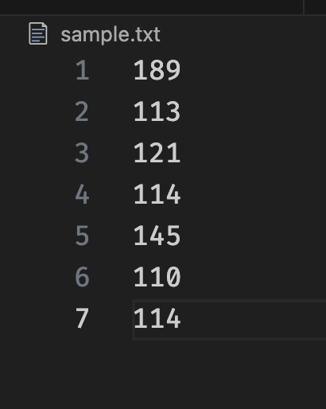
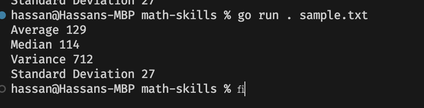

# Math Skills
this cli tool takes a text file with a number on each line and then calculates
- Average
- Median
- Variance
- Standard Deviation

and prints them to the console

take this file for example 



run the following command
```bash
go run . [filename]
```
you will get the following output

